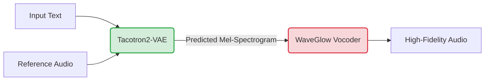

# 🎙️ Cross-Lingual Emotion Voice Conversion System
### *Powered by Tacotron2-VAE and WaveGlow*

---

## 📖 Table of Contents
1. [Project Overview](#1-project-overview)
2. [Repository Structure](#2-repository-structure)
3. [Data Pipeline & Preprocessing](#3-data-pipeline--preprocessing)
4. [System Architecture](#4-system-architecture)
   - [Macro Pipeline](#41-macro-pipeline)
   - [Tacotron2-VAE Acoustic Model](#42-tacotron2-vae-acoustic-model)
   - [WaveGlow Neural Vocoder](#43-waveglow-neural-vocoder)
5. [Loss Functions & Objectives](#5-loss-functions--objectives)
6. [Training Workflows](#6-training-workflows)
7. [Diagnostic & Analysis Notebooks](#7-diagnostic--analysis-notebooks)
8. [Installation & Quickstart](#8-installation--quickstart)

---

## 1. Project Overview

The **ML2 Final Project** repository implements a highly expressive, stable, two-stage framework for cross-lingual emotion voice conversion.

By leveraging a **Variational Autoencoder (VAE)** infused with a Global Style Token (GST) nested inside a **Tacotron2** acoustic model, the system effectively disentangles linguistic content (from text) from speaker prosody and emotion (from reference audio). The generated acoustic features are then inverted into high-fidelity audio waveforms in real-time using **WaveGlow**, a flow-based generative network.

**Supported Datasets:**
- LibriSpeech-PT (Portuguese)
- LibriSpeech-EN (English)
- TTS Portuguese Corpus
- VERBO (Emotion/Affective Dataset)

---

## 2. Repository Structure

The project is heavily modularized to separate data storage, isolated neural network definitions, and independent training orchestrators.

```text
ml2_final_project/
├── data/
│   ├── raw/                             # Original, unmodified audio corpora
│   └── processed/                       # Serialized .pt tensors and metadata CSV manifests
├── scripts/
│   ├── download_datasets/               # Shell/Python corpus fetchers
│   ├── inference/                       # Audio generation utilities
│   ├── preprocess/                      # Normalization & Mel-spectrogram extraction scripts
│   └── utils/                           # Model analysis and utility scripts
├── src/
│   ├── data/                            # PyTorch Datasets and DataLoaders
│   │   ├── loader_vae_tacotron/         # TextMelCollate and dynamic STFT loaders
│   │   └── loader_waveglow/             # Mel2Samp dataloaders
│   ├── models/                          # Neural Network Architecture
│   │   ├── tacotron2_vae/               # Encoder, Decoder, Postnet, VAE, and Attention
│   │   └── waveglow/                    # Invertible Convolutions and Affine Coupling flows
│   └── training/                        # Checkpointing, loops, and distributed setups
│       ├── training-tacotron2-vae/
│       └── training-waveglow/
├── notebooks/                           # Interactive Jupyter demos and spectral analysis
├── experiments/                         # Output artifacts, tensorboard logs, plots, checkpoints
└── remote_access/                       # SSH automation/configs for cluster training
```

---

## 3. Data Pipeline & Preprocessing

The pipeline ensures identical frequency resolution across the Acoustic Model and the Vocoder to prevent mismatch artifacts during inference.

### 3.1. Offline Preprocessing (`scripts/preprocess/`)

1. **Discovery:** Scripts recursively search for transcript files (e.g., `*.trans.txt`).
2. **Resampling:** Audio is loaded via `torchaudio`, converted to mono, and resampled to the target rate (`22050 Hz` or `16000 Hz`).
3. **Feature Extraction:** Standardized 80-bin Mel-spectrograms are extracted.
4. **Filtering:** Utterances outside the 0.3s – 10.0s bounds are discarded to prevent Out-Of-Memory (OOM) errors.
5. **Serialization:** Saved as individual `.pt` dictionaries alongside a central `mels_metadata.csv` manifest.

### 3.2. Online Loading (`src/data/`)

- **Tacotron Loader:** Reads the manifest, dynamically recomputes the STFT on the GPU during the `__getitem__` call to ensure gradient detachment, and applies Text Normalization (Regex + `num2words`). It also injects a `[4]-dim` Emotion Tensor for affective conditioning.
- **WaveGlow Loader:** `Mel2Samp` slices random fixed-length audio segments (e.g., 8000 samples) and returns `(mel_spectrogram, audio_waveform)` pairs.

---

## 4. System Architecture

### 4.1. Macro Pipeline



### 4.2. Tacotron2-VAE Acoustic Model

The Acoustic Model transforms text to Mel-spectrograms while cloning the target prosody.

1. **Text Encoder:**
   - Character Embedding (Dim: 512).
   - 3x 1D Convolutional Layers (k=5) + BatchNorm + ReLU + 50% Dropout.
   - Bidirectional LSTM (Hidden: 256/direction → 512).

2. **VAE Prosody Extractor:**
   - Reference Encoder (2D Convs → GRU) maps the 80-bin target mel to a 256-dim vector.
   - Splitting outputs μ and log σ² (Dim: 32).
   - Reparameterization Trick: `z = μ + σ ⊙ ε`.
   - Linear projection to `E_style` (Dim: 512), which is added to the Text Embeddings.

3. **Location-Sensitive Attention:** Forces monotonic alignment by convolving over previous attention weights (Location Layer Conv1d k=31).

4. **Autoregressive Decoder:**
   - 2-Layer Prenet (Dim: 256) acting as an information bottleneck.
   - 2x LSTMCells (Dim: 1024) processing attention context.
   - Linear projections output the next Mel frame and a Stop Token probability.

5. **PostNet:** A 5-layer 1D Convolutional network predicting a residual to smooth the decoder's output.

### 4.3. WaveGlow Neural Vocoder

WaveGlow acts as an invertible Normalizing Flow, maximizing the exact log-likelihood of the data.

- **Prior:** Starts with `z ~ N(0, I)`.
- **Conditioning:** The Mel-spectrogram is upsampled via Transposed Convolutions to match the audio sampling rate.
- **Flow Steps (x12):**
  - **Invertible 1x1 Convolution:** Mixes channel dimensions. Weight matrix initialized via QR decomposition.
  - **Affine Coupling Layer (WaveNet):**
    - Splits audio channels into `x_a` and `x_b`.
    - `x_a` and the Mel-spectrogram condition a dilated, non-causal WaveNet (8 layers).
    - Outputs scale (`log s`) and translation (`t`).
    - Transform: `x_b' = x_b ⊙ exp(log s) + t`.

---

## 5. Loss Functions & Objectives

### 5.1. Tacotron2-VAE

The loss combines L2 reconstruction, Binary Cross-Entropy, and KL Divergence:

1. **Reconstruction Loss:**  
   `L_Recon = || Mel_target - Mel_dec ||² + || Mel_target - Mel_post ||²`

2. **Gate Loss:** `BCEWithLogits` for the stop token.

3. **KL Divergence:**  
   `-0.5 * Σ(1 + log(σ²) - μ² - σ²)`

4. **KL Annealing:** Uses a logistic schedule to prevent posterior collapse early in training.

- `Total Loss = L_Recon + L_Gate + w_KL(step) * L_KL`

### 5.2. WaveGlow

Trained using Negative Log-Likelihood (NLL) derived from the change of variables theorem:

- `L_NLL = 1 / (B * C * T) * (Σ z² / (2σ²) - Σ log s - Σ log |det W|)`

---

## 6. Training Workflows

Because of the architectural complexity, the two systems are trained independently.

### Phase 1: Tacotron2-VAE Training

Trains the prosody extraction and the text-to-mel alignment.

```bash
python src/training/training-tacotron2-vae/train.py \
    --epochs 300 \
    --batch-size 32 \
    --learning-rate 1e-3 \
    --artifacts-dir data/processed/libriSpeech-en-tacotron-vae \
    --experiment-name v1_tacotron
```

### Phase 2: WaveGlow Training (Distributed)

Requires significant compute. Implements Distributed Data Parallel (DDP) and NVIDIA Apex FP16 Mixed Precision (`O1`).

```bash
python -m torch.distributed.launch --nproc_per_node=2 \
    src/training/training-waveglow/train.py \
    -c src/models/waveglow/config.json \
    --checkpoints_dir experiments/waveglow/checkpoints
```

---

## 7. Diagnostic & Analysis Notebooks

The repository includes state-of-the-art interactive Jupyter notebooks inside the `notebooks/` directory to monitor training visually and analyze data.

### 1. `tacotron2_vae_demo.ipynb`

- **Purpose:** Live, visual training loop for Tacotron2-VAE.
- **Features:** Plots total loss, reconstruction loss, KL loss, and displays the **Target vs. Generated Mel-spectrograms** in real-time.
- **PCA Diagnostic:** Extracts the latent space `z` across the validation batch and runs SVD to plot the Singular Values, ensuring the VAE is utilizing its latent dimensions properly.

### 2. `waveglow_demo.ipynb`

- **Purpose:** Live, visual training loop for WaveGlow.
- **Features:** Plots the NLL loss and compares the Target Audio Waveform against the conditioned Mel-Spectrogram.
- **Prior Diagnostic:** Plots a live histogram of the output `z` over a standard normal `N(0,1)` PDF line to verify that the Normalizing Flow is correctly mapping audio to the Gaussian prior.

### 3. `spectral_analisys.ipynb`

- **Purpose:** Offline dataset analytics.
- **Features:**
  - Instantiates the `TacotronSTFT` engine to visualize waveforms.
  - Computes Global Mean and Variance across the 80 Mel bins for the entire dataset.
  - Applies **K-Means Clustering** and visualizes the dataset distribution using **PCA** and **t-SNE** 2D projections.
  - *Future Ready:* Contains a wrapper function `analyze_dataset()` specifically built to execute this pipeline on the upcoming VERBO dataset.

---

## 8. Installation & Quickstart

### Prerequisites

- Python 3.10+
- CUDA 11.8+ / CuDNN
- NVIDIA APEX (Required for WaveGlow FP16 training)

### Setup

```bash
# 1. Clone the repository
git clone https://github.com/rick0110/ml2_final_project.git
cd ml2_final_project
git checkout merge/preparing_merge_vae_tacotron

# 2. Setup Virtual Environment
python -m venv .venv
source .venv/bin/activate

# 3. Install Requirements
pip install -r requirements.txt

# 4. Initialize Directories
bash initialize_directories.sh
```

### Data Preparation Example

```bash
python scripts/preprocess/preprocess_libri-Speech-en_vaeTacotron.py \
  --input-dir data/raw/libriSpeech-en \
  --out-dir data/processed/libriSpeech-en-tacotron-vae
```